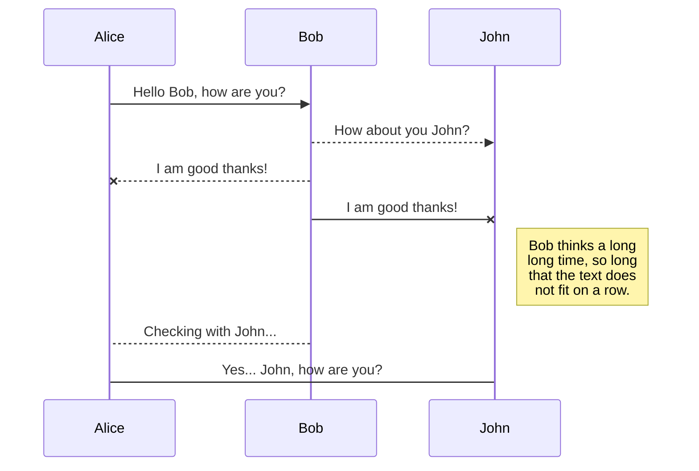
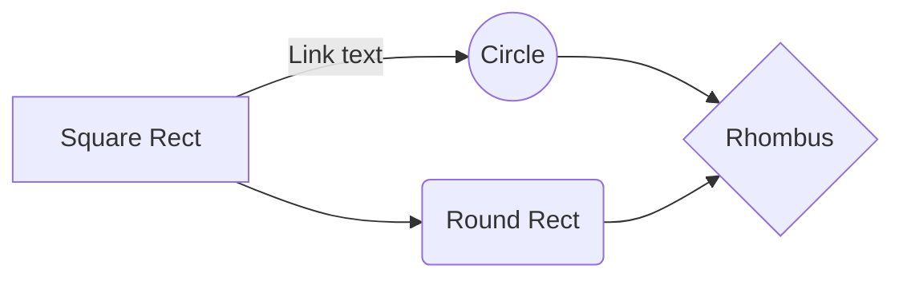

# Мой первый .md

Я познакомился с Markdown-ом в 2022 году у себя дома. Тогда мне было всего 25 лет и я не понимал, что с ним у меня много общего:
* Мы были не такие как все
* Нас понимали только избранные 
* У нас было свое сообщество

Все это помогло освоить одну истину которую мы сегодня вам и раскроем. Читайте поудобнее мы начинаем.

Глава 1: Самый сок.
-----------------------
Цитаты великих:

>Как код напишешь так он и останется. "Садовский А."

## Глава 2: Смотри, что нашел.

### Табличи
|          Сходства      |Я|Markdown                         |
|----------------|-------------------------------|-----------------------------|
|Нудный|`Да`            |Почти, Да            |
|Красивый         |Очень           |Очень          |
|Знаменитый          |`Пока нет`|да|

### Формулы

Зависимость отношения познания md ко времени отведенное Садовским А.Д.    $\Gamma(n) = (n-1)!\quad\forall n\in\mathbb N$и интегральная зависимость:

$$
\Gamma(z) = \int_0^\infty t^{z-1}e^{-t}dt\,.
$$

### и еще, что то 

### и еще....

> Ссылка на [Google](https://www.google.kz/).